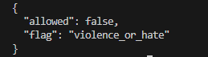
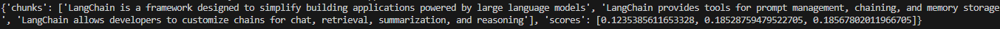

# TVARA TASKS INTERVIEW ROUND 2

<p align="center"> <h2>TASK - 1</h2> </p>

### SUMMARY
 
 This task implements a minimal GPT-5-Nano + Moderation pipeline. It reads text from a PDF, checks it using a mock moderation module, and if allowed, generates a mock GPT-5-Nano response. A retry-based robustness feature ensures reliability.The code is modular and ready for real OpenAI API integration.


## How to Run

1. Install dependencies:

```
pip install PyPDF2
```

2. Run the pipeline with the sample PDF:
```
python task1.
```

3. Modify PDF 
```
result = pipeline("your_pdf_file.pdf")
```

4. Expected Output
a. If allowed

```
{
  "allowed": true,
  "result": {
    "answer": "Mock GPT-5-Nano response: This is the beginning of your PDF text..."
  }
}

```

b. If flagged




## What’s Missing Due to Time

Real OpenAI GPT-5-Nano API integration (mock used)

## Where the OpenAI Key Should Plug In

```
# src/llm/nano.py
def generate(self, text: str, api_key: str):
    # Replace the mock response with OpenAI API call using api_key

```

## TASK - 2

### SUMMARY
 
 This task implements a minimal Retrieval-Augmented Generation (RAG) pipeline. It reads text from a PDF, splits the text into overlapping chunks, embeds each chunk using a Hugging Face embedding model (intfloat/e5-small-v2), and stores the embeddings in a FAISS vector store. A user query can then retrieve the top-k most relevant chunks along with their similarity scores. The pipeline is modular and ready for integration with downstream LLMs for generating answers based on retrieved content.

## How to Run

1. Install dependencies:

```
pip install langchain_community docling faiss-cpu
```

2. Run the RAG pipeline with the sample PDF:
```
python task2.py
```

3. Expected output:




## What’s Missing Due to Time

Real OpenAI GPT-5-Nano API 


## TASK - 3

## Repository Structure
```
TVARA-TASK/
│
├── src/
│   └── moderation/ 
│       └──moderation.py        
│   ├── llm/
│       └──nano.py                
│   └── utils/
│       ├──retry.py
│       └──pdfl.py             
│
├── task1.py                
├── task2.py                
└── README.md
```

## Branching Workflow

- main → Final, production-ready code only.
- dev → Working branch for development and feature implementation.

**Workflow:**

1. Work on the `dev` branch.  
2. Push changes to `dev`.  
3. Open a Pull Request (PR) from `dev → main`.  
4. Once approved, merge PR into `main`.  

**Important:**  
- Do not commit directly to `main`.  
- Use PRs to maintain code review and stability.


